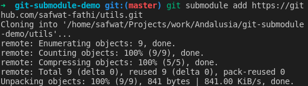
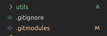

# Git submodule POC (Prove Of Concept)

A vue app that implies git submodules as code-sharing method.

## Hosted submodules

1. Utility functions [utils](https://github.com/safwat-fathi/utils.git).
2. Layout components (to be built).

## Using submodule [full official docs](https://git-scm.com/book/en/v2/Git-Tools-Submodules)

1. Build an independent git repo for submodule (test does it has to be public?).
2. In the current repo that will host the submodule:

```
git submodule add <link/ssh URL of submodule repo>
```

3. Notice two changes (.gitmodules file added, new directory added with submodule name).
4. Now use the submodule as it a part of your source code.

## **Note**: Submodule workflows

- **Once submodules are properly initialized and updated within a parent repository they can be utilized exactly like stand-alone repositories. This means that submodules have their own branches and history.**
- **When making changes to a submodule it is important to publish submodule changes and then update the parent repositories reference to the submodule.**

## Removing a submodule

```
git submodule deinit -f -- dir/of/submodule
rm -rf .git/modules/the/submodule
git rm -f dir/of/submodule
```

## Changes history

1. new submodule added (utils).



2. changes in parent repo.


