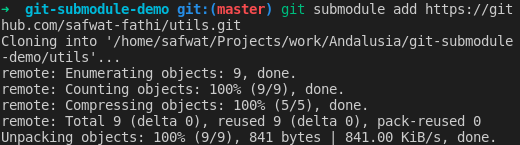
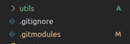
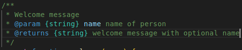
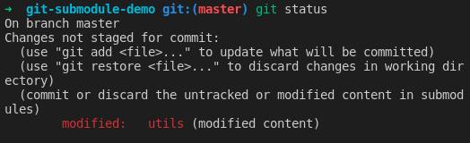
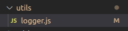
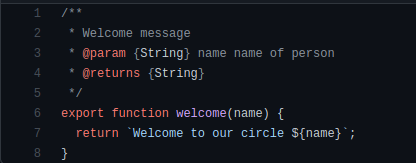
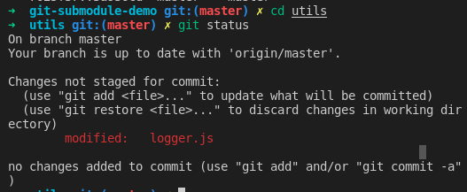
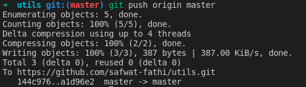
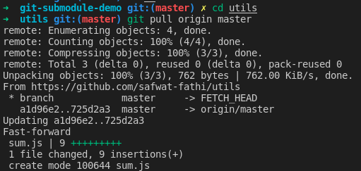

# Git submodule POC (Prove Of Concept)

A vue app that implies git submodules as code-sharing method.

## Hosted submodules

1. Utility functions [utils](h/screenshotsttps://github.com/safwat-fathi/utils.git).
2. Layout components (to be built).

## Using submodule [full official docs](h/screenshotsttps://git-scm.com/book/en/v2/Git-Tools-Submodules)

1. Build an independent git repo for submodule (test does it has to be public?).
2. In the current repo that will host the submodule:

```
git submodule add <link/ssh URL of submodule repo>
```

3. Notice two changes (.gitmodules file added, new directory added with submodule name).
4. Now use the submodule as it a part of your source code.

## **Note**: Submodule workflows

- **Once submodules are properly initialized and updated within a parent repository they can be utilized exactly like stand-alone repositories. This means that submodules have their own branches and history.**
- **When making changes to a submodule it is important to publish submodule changes and then update the parent repositories reference to the submodule.**

## Removing a submodule

```
git submodule deinit -f -- dir/of/submodule
rm -rf .git/modules/the/submodule
git rm -f dir/of/submodule
```

## Changes history

### 1. new submodule added (utils).



### 2. changes in parent repo.



### 3. changes in submodule (hosted repo) done from parent repo.







### 4. changes pushed to parent repo.

**Note: as of now all changes done & published from hosted repo and submodule repo not affected with any of this changes**





### 5. push changes to submodule repo (from submodule directory)



### 6. getting new changes from remote (team member changed submodule)




## **Importnat note using git submodules as a team**

When working with submodules, a common pattern of confusion and error is forgetting to push updates for remote users.

If we revisit the utils work we just did, and only pushed the updates to the parent repository.

Another developer would go to pull the latest parent repository and it would be pointing at a commit of awesomelibrary that they were unable to pull because we had forgotten to push the submodule.

This would break the remote developers local repo.

To avoid this failure scenario make sure to always commit and push the submodule and parent repository.
